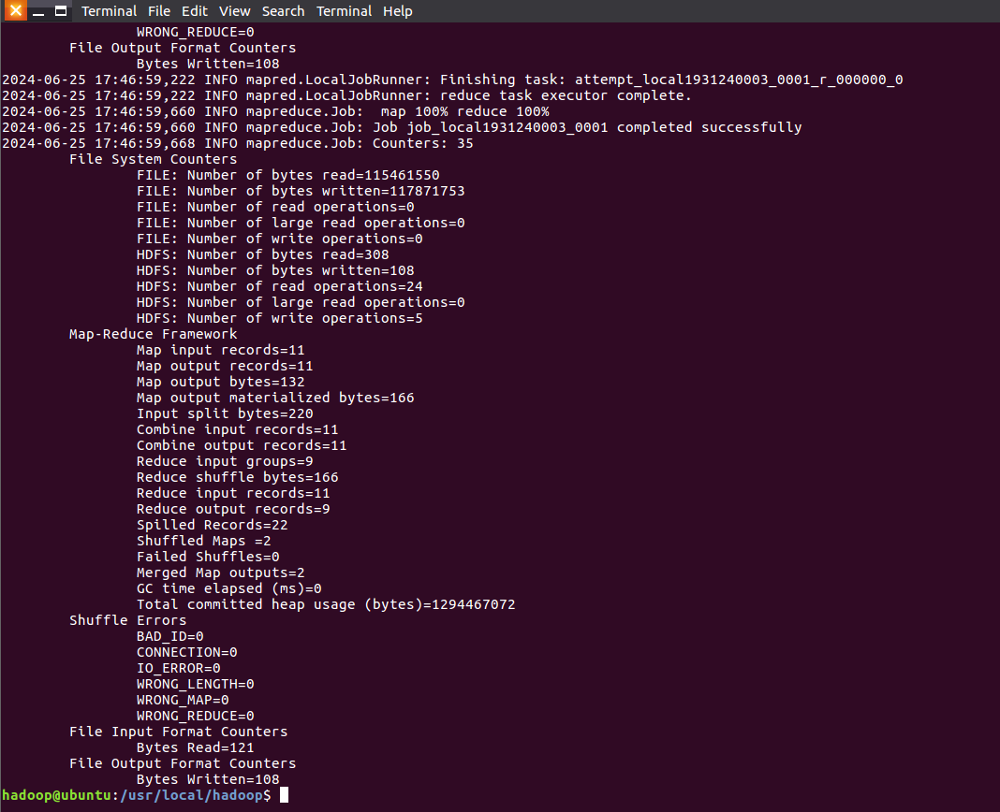
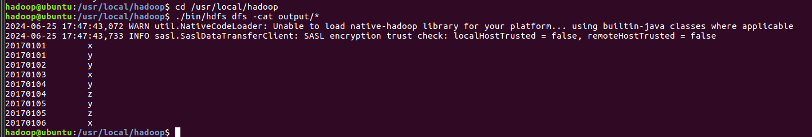
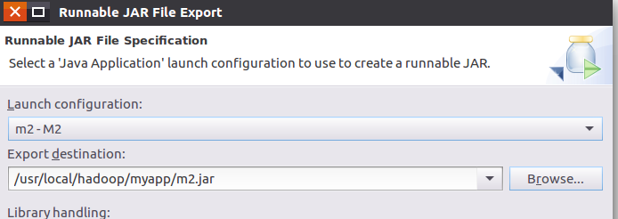
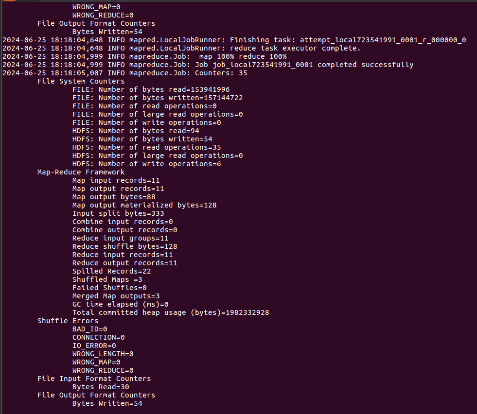
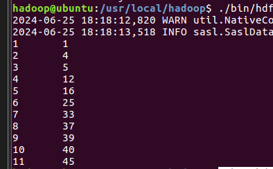

# MapReduce

## 1.编程实现文件合并和去重操作

先直接启动hadoop
```shell
cd /usr/local/hadoop
./sbin/start-dfs.sh
```

接下来新建两个待处理的文件

注意:vim需要先输入`i`再粘贴文字,之后输入`:wq`来保存并退出,输入`q!`强制退出

注意:vim需要先输入`i`再粘贴文字,之后输入`:wq`来保存并退出,输入`q!`强制退出

注意:vim需要先输入`i`再粘贴文字,之后输入`:wq`来保存并退出,输入`q!`强制退出

注意:vim需要先输入`i`再粘贴文字,之后输入`:wq`来保存并退出,输入`q!`强制退出

注意:vim需要先输入`i`再粘贴文字,之后输入`:wq`来保存并退出,输入`q!`强制退出

注意:vim需要先输入`i`再粘贴文字,之后输入`:wq`来保存并退出,输入`q!`强制退出

注意:vim需要先输入`i`再粘贴文字,之后输入`:wq`来保存并退出,输入`q!`强制退出

注意:vim需要先输入`i`再粘贴文字,之后输入`:wq`来保存并退出,输入`q!`强制退出

注意:vim需要先输入`i`再粘贴文字,之后输入`:wq`来保存并退出,输入`q!`强制退出

注意:vim需要先输入`i`再粘贴文字,之后输入`:wq`来保存并退出,输入`q!`强制退出

注意:vim需要先输入`i`再粘贴文字,之后输入`:wq`来保存并退出,输入`q!`强制退出

注意:vim需要先输入`i`再粘贴文字,之后输入`:wq`来保存并退出,输入`q!`强制退出

注意:vim需要先输入`i`再粘贴文字,之后输入`:wq`来保存并退出,输入`q!`强制退出

注意:vim需要先输入`i`再粘贴文字,之后输入`:wq`来保存并退出,输入`q!`强制退出

注意:vim需要先输入`i`再粘贴文字,之后输入`:wq`来保存并退出,输入`q!`强制退出

注意:vim需要先输入`i`再粘贴文字,之后输入`:wq`来保存并退出,输入`q!`强制退出

```shell
vim A.txt
```

```
20170101	x
20170102	y
20170103	x
20170104	y
20170105	z
20170106	x
```

```shell
vim B.txt
```

```
20170101	y
20170102	y
20170103	x
20170104	z
20170105	y
```

删除之前的input和output文件夹

```shell
cd /usr/local/hadoop
./bin/hdfs dfs -rm -r input
./bin/hdfs dfs -rm -r output
```

删除hadoop中的output,也许没有,没有就不用管
```shell
cd /usr/local/hadoop
./bin/hdfs dfs -rm -r /user/hadoop/output
```

再重新创建一个文件夹
```shell
cd /usr/local/hadoop
./bin/hdfs dfs -mkdir input
```

上传刚才创建的两个文件到hadoop里面
```shell
cd /usr/local/hadoop
./bin/hdfs dfs -put ./A.txt input
./bin/hdfs dfs -put ./B.txt input
```

创建一个装代码的文件夹
```shell
cd /usr/local/hadoop
mkdir myapp
```
这里如果显示`已经有了`就不用管

接下来打开eclipse

```shell
cd /usr/local/eclipse
./eclipse
```

创建文件并按照视频里面命名

创建文件并按照视频里面命名

创建文件并按照视频里面命名

创建文件并按照视频里面命名

创建文件并按照视频里面命名

创建文件并按照视频里面命名

创建文件并按照视频里面命名

创建文件并按照视频里面命名

创建文件并按照视频里面命名

创建文件并按照视频里面命名
<video controls src="mp1.mp4" title="Title"></video>

输入以下代码
```java
import java.io.IOException;
import org.apache.hadoop.conf.Configuration;
import org.apache.hadoop.fs.Path;
import org.apache.hadoop.io.IntWritable;
import org.apache.hadoop.io.Text;
import org.apache.hadoop.mapreduce.Job;
import org.apache.hadoop.mapreduce.Mapper;
import org.apache.hadoop.mapreduce.Reducer;
import org.apache.hadoop.mapreduce.lib.input.FileInputFormat;
import org.apache.hadoop.mapreduce.lib.output.FileOutputFormat;
import org.apache.hadoop.util.GenericOptionsParser;

public class m {

	public static class Map extends Mapper<Object, Text, Text, Text>{
		private static Text text = new Text();
		public void map(Object key, Text value, Context context) throws IOException,InterruptedException{
			text = value;
			context.write(text, new Text(""));
		}
	}

	public static class Reduce extends Reducer<Text, Text, Text, Text>{
		public void reduce(Text key, Iterable<Text> values, Context context ) throws IOException,InterruptedException{
			context.write(key, new Text(""));
		}
	}
	
	public static void main(String[] args) throws Exception{
		
		Configuration conf = new Configuration();
        conf.set("fs.default.name","hdfs://localhost:9000");
		String[] otherArgs = new String[]{"input","output"};
		if (otherArgs.length != 2) {
			System.err.println("Usage: wordcount <in> <out>");
			System.exit(2);
			}
		Job job = Job.getInstance(conf,"Merge and duplicate removal");
		job.setJarByClass(m.class);
		job.setMapperClass(Map.class);
		job.setCombinerClass(Reduce.class);
		job.setReducerClass(Reduce.class);
		job.setOutputKeyClass(Text.class);
		job.setOutputValueClass(Text.class);
		FileInputFormat.addInputPath(job, new Path(otherArgs[0]));
		FileOutputFormat.setOutputPath(job, new Path(otherArgs[1]));
		System.exit(job.waitForCompletion(true) ? 0 : 1);
	}

}
```

`运行一下之后`按照下面视频导出 | ***出错正常***

`运行一下之后`按照下面视频导出 | ***出错正常***

`运行一下之后`按照下面视频导出 | ***出错正常***

`运行一下之后`按照下面视频导出 | ***出错正常***

`运行一下之后`按照下面视频导出 | ***出错正常***

`运行一下之后`按照下面视频导出 | ***出错正常***

`运行一下之后`按照下面视频导出 | ***出错正常***

`运行一下之后`按照下面视频导出 | ***出错正常***

导出的时候要点内个项目,像实验一就点上`M`之后再右键导出

### ↓↓↓↓导出方法↓↓↓↓

<video controls src="m2.mp4" title="Title"></video>

接下来`新建`一个命令行窗口来运行一下

```shell
cd /usr/local/hadoop
./bin/hadoop jar ./myapp/m.jar input output
```

出现如下界面表示运行成功



查看运行结果
```shell
cd /usr/local/hadoop
./bin/hdfs dfs -cat output/*
```

正确结果




---

## 2.编写程序实现对输入文件的排序

删除之前的input和output文件夹

```shell
cd /usr/local/hadoop
./bin/hdfs dfs -rm -r input
./bin/hdfs dfs -rm -r output
```

删除hadoop中的output
```shell
cd /usr/local/hadoop
./bin/hdfs dfs -rm -r /user/hadoop/output
```

再重新创建一个文件夹
```shell
cd /usr/local/hadoop
./bin/hdfs dfs -mkdir input
```

新建三个文件

```shell
vim f1.txt
```

输入

```
33
37
12
40
```

---

```shell
vim f2.txt
```

输入

```
4
16
39
5
```

---

```shell
vim f3.txt
```

输入

```
1
45
25
```

上传三个文件到hadoop中

```shell
cd /usr/local/hadoop
./bin/hdfs dfs -put ./f1.txt input
./bin/hdfs dfs -put ./f2.txt input
./bin/hdfs dfs -put ./f3.txt input
```

---

第二个java项目命名为`M2`,class命名为`m2`

第二个java项目命名为`M2`,class命名为`m2`

第二个java项目命名为`M2`,class命名为`m2`

第二个java项目命名为`M2`,class命名为`m2`

第二个java项目命名为`M2`,class命名为`m2`

第二个java项目命名为`M2`,class命名为`m2`

代码
```java
import java.io.IOException;

import org.apache.hadoop.conf.Configuration;
import org.apache.hadoop.fs.Path;
import org.apache.hadoop.io.IntWritable;
import org.apache.hadoop.io.Text;
import org.apache.hadoop.mapreduce.Job;
import org.apache.hadoop.mapreduce.Mapper;
import org.apache.hadoop.mapreduce.Partitioner;
import org.apache.hadoop.mapreduce.Reducer;
import org.apache.hadoop.mapreduce.lib.input.FileInputFormat;
import org.apache.hadoop.mapreduce.lib.output.FileOutputFormat;
import org.apache.hadoop.util.GenericOptionsParser;


public class m2 {
	public static class Map extends Mapper<Object, Text, IntWritable, IntWritable>{
		private static IntWritable data = new IntWritable();
		public void map(Object key, Text value, Context context) throws IOException,InterruptedException{
			String text = value.toString();
			data.set(Integer.parseInt(text));
			context.write(data, new IntWritable(1));
		}
	}
	public static class Reduce extends Reducer<IntWritable, IntWritable, IntWritable, IntWritable>{
		private static IntWritable line_num = new IntWritable(1);
		
		public void reduce(IntWritable key, Iterable<IntWritable> values, Context context) throws IOException,InterruptedException{
			for(IntWritable val : values){
				context.write(line_num, key);
				line_num = new IntWritable(line_num.get() + 1);
			}
		}
	}
	public static class Partition extends Partitioner<IntWritable, IntWritable>{
		public int getPartition(IntWritable key, IntWritable value, int num_Partition){
			int Maxnumber = 65223;
			int bound = Maxnumber/num_Partition+1;
			int keynumber = key.get();
			for (int i = 0; i<num_Partition; i++){
				if(keynumber<bound * (i+1) && keynumber>=bound * i){
					return i;
				}
			}
			return -1;
		}
	}
	public static void main(String[] args) throws Exception{
		Configuration conf = new Configuration();
        conf.set("fs.default.name","hdfs://localhost:9000");
		String[] otherArgs = new String[]{"input","output"};
		if (otherArgs.length != 2) {
			System.err.println("Usage: wordcount <in> <out>");
			System.exit(2);
			}
        Job job = Job.getInstance(conf,"Merge and sort");
		job.setJarByClass(m2.class);
		job.setMapperClass(Map.class);
		job.setReducerClass(Reduce.class);
		job.setPartitionerClass(Partition.class);
		job.setOutputKeyClass(IntWritable.class);
		job.setOutputValueClass(IntWritable.class);
		FileInputFormat.addInputPath(job, new Path(otherArgs[0]));
		FileOutputFormat.setOutputPath(job, new Path(otherArgs[1]));
		System.exit(job.waitForCompletion(true) ? 0 : 1);

	}
}
```
之后`运行一下`,然后导出,

之后`运行一下`,然后导出,

之后`运行一下`,然后导出,

之后`运行一下`,然后导出,

注意导出的名字写`m2`

注意导出的名字写`m2`

注意导出的名字写`m2`

注意导出的名字写`m2`

注意导出的名字写`m2`

注意导出的名字写`m2`

注意导出的名字写`m2`

注意导出的名字写`m2`

↓↓↓↓如下图所示↓↓↓↓



导出方法参照上面第一个[点击查看,点击就是要点击而不是不点击](#导出方法)

输入`./bin/hadoop jar ./myapp/m2.jar input output`运行

正确运行应该出现下面的文字



之后运行`./bin/hdfs dfs -cat output/*`查看运行结果



---

## 3.对指定的表格进行信息挖掘

多合一操作

```shell
cd /usr/local/hadoop
./bin/hdfs dfs -rm -r input
./bin/hdfs dfs -rm -r output
./bin/hdfs dfs -rm -r /user/hadoop/output
./bin/hdfs dfs -mkdir input
```

新建文件

```shell
vim cp.txt
```

上传文件到hadoop中

```shell
cd /usr/local/hadoop
./bin/hdfs dfs -put ./cp.txt input
```

新建名为`M3`的project, class名为`m3`

```java

```
